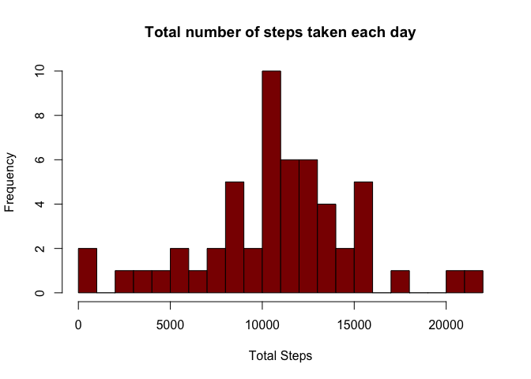
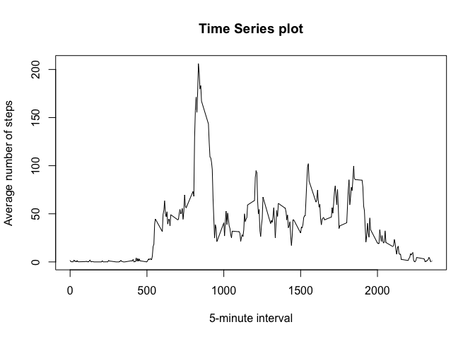
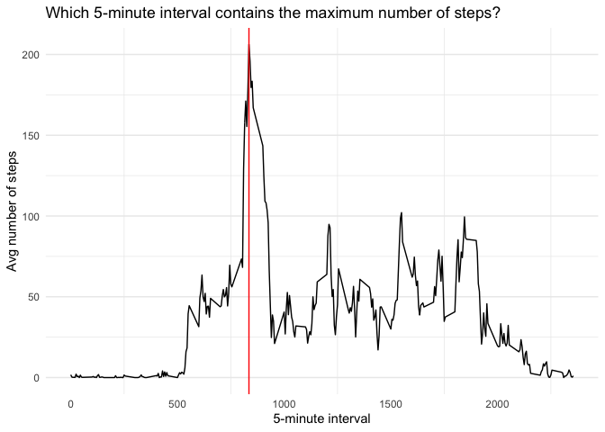
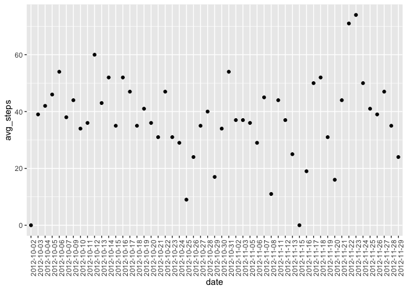
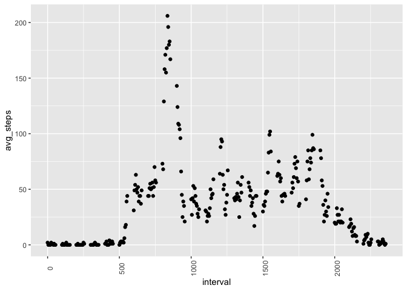
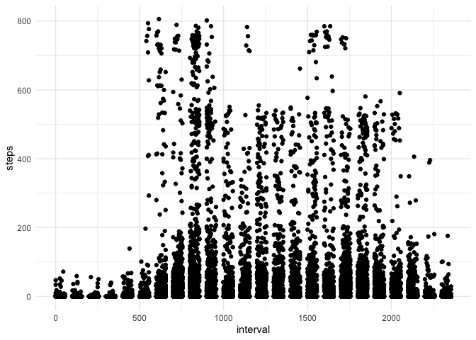
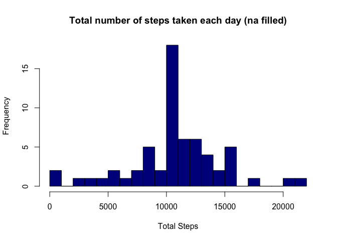
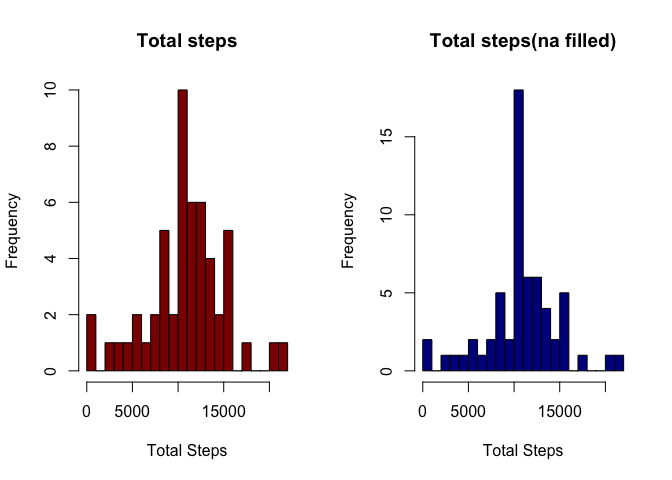
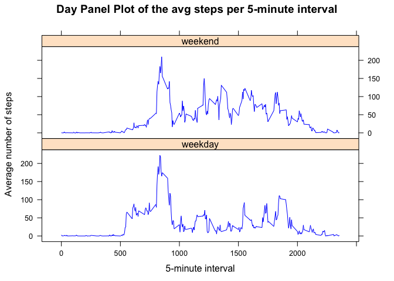

## Loading and preprocessing the data


```r
backup<- read.csv("activity.csv")
head(backup)
```

```
##   steps       date interval
## 1    NA 2012-10-01        0
## 2    NA 2012-10-01        5
## 3    NA 2012-10-01       10
## 4    NA 2012-10-01       15
## 5    NA 2012-10-01       20
## 6    NA 2012-10-01       25
```


## What is mean total number of steps taken per day?

Ignore the missing values in the dataset.
Calculate the total number of steps taken per day


```r
df<-backup%>%filter(!is.na(steps))%>%
  group_by(date)%>%
  summarize(tot_steps=sum(steps))
df
```

```
## # A tibble: 53 x 2
##    date       tot_steps
##    <fct>          <int>
##  1 2012-10-02       126
##  2 2012-10-03     11352
##  3 2012-10-04     12116
##  4 2012-10-05     13294
##  5 2012-10-06     15420
##  6 2012-10-07     11015
##  7 2012-10-09     12811
##  8 2012-10-10      9900
##  9 2012-10-11     10304
## 10 2012-10-12     17382
## # … with 43 more rows
```
Make a histogram of the total number of steps taken each day


```r
hist(df$tot_steps,breaks=30,
     col="darkred",
     main="Total number of steps taken each day",
     xlab="Total Steps")
```

<!-- -->

Calculate and report the mean and median of the total number of steps taken per day


```r
data.frame(mean=round(mean(df$tot_steps)),median=round(median(df$tot_steps)))
```

```
##    mean median
## 1 10766  10765
```


## What is the average daily activity pattern?

Make a time series plot (i.e. \color{red}{\verb|type = "l"|}type = "l") of the 5-minute interval (x-axis) and the average number of steps taken, averaged across all days (y-axis)


```r
df2<-backup%>%filter(!is.na(steps))%>%
  group_by(interval)%>%
  summarize(avg_steps=mean(steps))
```


```r
with(df2,plot(x=interval,y=avg_steps,type="l",
     main="Time Series plot",
     xlab ="5-minute interval",
     ylab="Average number of steps"))
```

<!-- -->

Which 5-minute interval, on average across all the days in the dataset, contains the maximum number of steps?


```r
df2%>%
  arrange(desc(avg_steps))%>%
  filter(avg_steps==max(avg_steps))
```

```
## # A tibble: 1 x 2
##   interval avg_steps
##      <int>     <dbl>
## 1      835      206.
```


```r
ggplot(data=df2,aes(x=interval,y=avg_steps))+
  geom_line()+
  geom_vline(xintercept = 835,colour="red") +
  labs(title="Which 5-minute interval contains the maximum number of steps?",
       x="5-minute interval",
       y="Avg number of steps")+
  theme_minimal()+
  theme(panel.grid.major.x = element_blank())
```

<!-- -->


## Imputing missing values

Calculate and report the total number of missing values in the dataset (i.e. the total number of rows with \color{red}{\verb|NA|}NAs)


```r
data.frame("Total_missing_vaues"=c(sum(is.na(backup$steps))))
```

```
##   Total_missing_vaues
## 1                2304
```

Devise a strategy for filling in all of the missing values in the dataset. 


1. As a first step take considaration of the possible imputation of the mean of the number of steps taken per day


```r
require(dplyr)
mean_by_date<-backup%>%filter(!is.na(steps))%>%
  group_by(date)%>%summarize(avg_steps=round(mean(steps)))
require(ggplot2)
ggplot(data=mean_by_date)+
  geom_point(aes(x=date,y=avg_steps)) +
  theme(axis.text.x = element_text(angle=90))
```

<!-- -->

2. Then consider the mean for the number of steps per 5-minute interval, and decide to use this option


```r
mean_by_5min<-backup%>%
  filter(!is.na(steps))%>%
  group_by(interval)%>%
  summarize(avg_steps=round(mean(steps)))

ggplot(data=mean_by_5min)+
  geom_point(aes(x=interval,y=avg_steps)) +
  theme(axis.text.x = element_text(angle=90))
```

<!-- -->

Here is the result of the filled column of the number of steps taken per day.


```r
require(zoo)
df_filled<-backup
df_filled$steps<-with(df_filled, ave(steps, interval, FUN = na.aggregate))
df_filled<-df_filled%>%mutate(steps=round(steps))

ggplot(data=df_filled)+
  geom_point(aes(x=interval,y=steps)) +
  theme_minimal() +
  theme(axis.text.x = element_text(angle=0))
```

<!-- -->


Create a new dataset that is equal to the original dataset but with the missing data filled in


```r
head(df_filled)
```

```
##   steps       date interval
## 1     2 2012-10-01        0
## 2     0 2012-10-01        5
## 3     0 2012-10-01       10
## 4     0 2012-10-01       15
## 5     0 2012-10-01       20
## 6     2 2012-10-01       25
```


Make a histogram of the total number of steps taken each day 


```r
df_filled_by_day<-df_filled %>%
  group_by(date)%>%
  summarize(tot_steps=sum(steps))

hist(df_filled_by_day$tot_steps,breaks=30,
     col="darkblue",
     main="Total number of steps taken each day (na filled)",
     xlab="Total Steps")
```

<!-- -->

The two histogram togeter to visualize the differences.


```r
par(mfrow=c(1,2))
hist(df$tot_steps,breaks=30,
     col="darkred",
     main="Total steps",
     xlab="Total Steps")
hist(df_filled_by_day$tot_steps,breaks=30,
     col="darkblue",
     main="Total steps(na filled)",
     xlab="Total Steps")
```

<!-- -->


Calculate and report the mean and median total number of steps taken per day. 


```r
data.frame(mean=round(mean(df_filled_by_day$tot_steps)),median=round(median(df_filled_by_day$tot_steps)))
```

```
##    mean median
## 1 10766  10762
```

Do these values differ from the estimates from the first part of the assignment? 


```r
my_table<-data.frame(mean=c(round(mean(df$tot_steps)),round(mean(df_filled_by_day$tot_steps))),
          median=c(round(median(df$tot_steps)),round(median(df_filled_by_day$tot_steps))),
          row.names=c("original with na","filled"))

my_table
```

```
##                   mean median
## original with na 10766  10765
## filled           10766  10762
```


What is the impact of imputing missing data on the estimates of the total daily number of steps?

The mean values are the same while the median slightly changed with a difference impact of 0.03%


```r
(my_table[1,2]-my_table[2,2])/my_table[1,2]*100
```

```
## [1] 0.02786809
```

## Are there differences in activity patterns between weekdays and weekends?

Use the dataset with the filled-in missing values, the \color{red}{\verb|weekdays()|}weekdays() function to create a new factor variable in the dataset with two levels – “weekday” and “weekend” indicating whether a given date is a weekday or weekend day.


```r
# ?weekday
weekend<-c("Friday","Saturday","Sunday")
my_df<-df_filled%>%mutate(date=as.Date(date,"%Y-%m-%d"),
                   day0=weekdays(date),
                   day=ifelse(weekdays(date)%in%weekend,"weekend","weekday"))

plyr::count(my_df$day)
```

```
##         x  freq
## 1 weekday 10368
## 2 weekend  7200
```


Make a panel plot containing a time series plot (i.e. \color{red}{\verb|type = "l"|}type = "l") of the 5-minute interval (x-axis) and the average number of steps taken, averaged across all weekday days or weekend days (y-axis). 


```r
s<-my_df %>%
  group_by(day,interval) %>%
  summarize(avg_steps=mean(steps)) %>%
  ungroup() 

library(lattice)

with(s, xyplot(avg_steps~interval | day, 
               type="l",col="blue",
               groups=day,
               layout = c(1,2),
               xlab="5-minute interval",
               ylab="Average number of steps",
               main="Day Panel Plot of the avg steps per 5-minute interval")
)
```

<!-- -->


